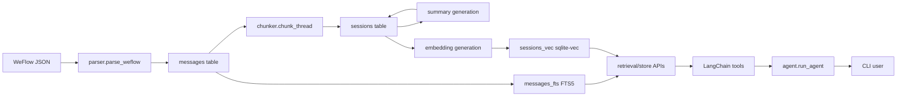

# 微信聊天记录检索 Agent 技术文档

本文档面向开发、维护和二次扩展，尽量把项目的运行机制、数据结构、关键取舍和优化方向写清楚。项目当前是一个本地 Python RAG 应用：导入 WeFlow 导出的微信聊天 JSON，写入 SQLite，构建全文索引和可选向量索引，再通过 LangChain 工具调用让聊天模型查询本地聊天记录。

## 1. 项目目标

本项目解决的问题是：把个人微信聊天记录变成一个可以自然语言查询、可追溯原文、可浏览上下文的本地知识库。

核心能力包括：

- 导入 WeFlow 导出的微信聊天 JSON。
- 只保留文本消息和引用消息，跳过图片、表情、文件等暂未解析类型。
- 将消息写入本地 SQLite 数据库。
- 构建 FTS5 全文索引，用于关键词和原文片段检索。
- 将聊天按时间、长度和消息数切成会话块。
- 可选调用聊天模型生成会话块摘要。
- 可选调用 embedding 模型生成向量索引。
- 通过 LangChain tools 暴露检索、上下文、时间浏览和统计能力。
- 通过命令行交互式 Agent 回答用户关于聊天记录的问题。

项目默认保护隐私：`.env`、`runtime/`、`local/`、数据库、聊天 JSON 和日志都被 `.gitignore` 排除，不应提交到远程仓库。

## 2. 总体架构



运行时分为两条主路径：

- 索引路径：`ingest.py` 负责从 JSON 到 SQLite、FTS、会话块、摘要和向量。
- 查询路径：`cli.py` 接收问题，`agent.py` 驱动模型选择工具，`tools.py` 调用 `store.py` 和 `retrieval.py` 返回结构化结果。

## 3. 目录结构

```text
wechat_agent/
  wechat_rag_agent/
    __init__.py
    agent.py          # Agent 主循环、系统提示词、工具调用调度
    chunker.py        # 将连续聊天消息切分为会话块
    cli.py            # 交互式命令行入口
    console.py        # Windows/终端 UTF-8 输出设置
    ingest.py         # 导入、增量索引、摘要和 embedding 流水线
    llm.py            # ChatOpenAI/OpenAIEmbeddings 客户端和重试封装
    parser.py         # WeFlow JSON 标准化解析
    retrieval.py      # 语义检索、FTS+向量融合
    store.py          # SQLite schema、读写、全文检索、向量检索
    tools.py          # LangChain tool 定义和参数校验
    scripts/
      check.py        # 模型/embedding 端点连通性检查
      smoke.py        # 本地检索链路冒烟脚本
  docs/
    TECHNICAL.md      # 当前技术文档
  local/              # 本地原始数据，Git 忽略
  runtime/            # 本地数据库，Git 忽略
  .env.example        # 环境变量模板
  requirements.txt
  README.md
  CHANGELOG.md
```

## 4. 运行环境和依赖

项目依赖在 `requirements.txt` 中声明：

| 依赖 | 用途 |
| --- | --- |
| `langchain` | Agent 消息结构和工具调用生态 |
| `langchain-openai` | OpenAI 兼容 Chat 和 Embedding 客户端 |
| `openai` | 底层 OpenAI 兼容 SDK |
| `python-dotenv` | 从 `.env` 加载本地配置 |
| `pydantic` | Tool 参数 schema 和校验 |
| `sqlite-vec` | SQLite 向量检索扩展 |

最低建议环境：

- Python 3.10 或更高版本。
- SQLite 支持 FTS5。
- 如果需要语义检索，运行环境需要能加载 `sqlite-vec`。
- 模型端点需要兼容 OpenAI Chat Completions 和 Embeddings 接口。

## 5. 配置项

配置通过 `.env` 读取，模板见 `.env.example`。

### 5.1 主聊天模型

| 变量 | 必填 | 默认值 | 说明 |
| --- | --- | --- | --- |
| `CHAT_BASE_URL` | 是 | 无 | OpenAI 兼容聊天模型 API 地址 |
| `CHAT_API_KEY` | 是 | 无 | 聊天模型 API Key |
| `CHAT_MODEL` | 是 | 无 | 交互式 Agent 使用的模型 |
| `CHAT_TIMEOUT` | 否 | `300` | 单次聊天请求超时时间，秒 |
| `CHAT_MAX_RETRIES` | 否 | `3` | SDK 内部重试次数 |
| `CHAT_LOCAL_RETRIES` | 否 | `3` | 项目本地封装的总尝试次数 |
| `CHAT_RETRY_SLEEP` | 否 | `1` | 本地重试递增等待秒数 |

### 5.2 数据库

| 变量 | 必填 | 默认值 | 说明 |
| --- | --- | --- | --- |
| `CHAT_DB` | 否 | `runtime/chat.db` | SQLite 数据库路径 |

建议保持在 `runtime/` 下，避免误提交。

### 5.3 Embedding

| 变量 | 必填 | 默认值 | 说明 |
| --- | --- | --- | --- |
| `EMBED_BASE_URL` | 否 | 无 | OpenAI 兼容 embedding API 地址 |
| `EMBED_API_KEY` | 否 | 无 | Embedding API Key |
| `EMBED_MODEL` | 否 | 无 | Embedding 模型名称 |
| `EMBED_DIM` | 否 | `1024` | 初始化向量表维度，实际导入时会按返回维度自动重建 |
| `EMBED_TIMEOUT` | 否 | `90` | Embedding 请求超时时间，秒 |
| `EMBED_MAX_RETRIES` | 否 | `0` | SDK 内部重试次数 |
| `EMBED_LOCAL_RETRIES` | 否 | `3` | 项目本地封装的总尝试次数 |
| `EMBED_RETRY_SLEEP` | 否 | `1` | 本地重试递增等待秒数 |

未配置 `EMBED_*` 时项目仍可工作，但 `semantic_search` 会退化为全文检索。

### 5.4 摘要生成

| 变量 | 必填 | 默认值 | 说明 |
| --- | --- | --- | --- |
| `SUMMARY_MODEL` | 否 | 无 | 索引期生成会话块摘要的模型 |
| `SUMMARY_WORKERS` | 否 | `2` | 摘要并发数 |
| `SUMMARY_BATCH_SIZE` | 否 | `4` | 每个摘要请求包含的会话块数 |
| `SUMMARY_MAX_CHARS` | 否 | `3000` | 每个会话块发送给模型的最大字符数 |
| `SUMMARY_FALLBACK_CHARS` | 否 | `1200` | 422/BadRequest 时缩短文本重试的字符数 |

摘要不是查询必需项，但会提升向量检索输入质量，因为 embedding 输入会优先拼接摘要和会话块正文。

### 5.5 导入调优

| 变量 | 默认值 | 说明 |
| --- | --- | --- |
| `EMBED_WORKERS` | `4` | Embedding 并发批次数 |
| `EMBED_BATCH_SIZE` | `32` | 每个 embedding 请求的会话块数量 |
| `PROGRESS_EVERY` | `50` | 每处理多少块输出一次进度 |
| `PROGRESS_INTERVAL` | `15` | Embedding 无完成批次时的等待提示间隔 |
| `INGEST_KEEP_GOING` | `false` | 模型/API 单批失败时是否继续处理其他批次 |

命令行参数会覆盖环境变量。

## 6. 数据模型

数据库默认位置为 `runtime/chat.db`。连接建立时会启用：

- `PRAGMA journal_mode = WAL`
- `PRAGMA busy_timeout = 30000`
- `PRAGMA synchronous = NORMAL`
- `PRAGMA cache_size = -64000`

这些设置偏向本地批量写入和查询性能。

### 6.1 `messages`

保存标准化后的单条消息。

| 字段 | 类型 | 说明 |
| --- | --- | --- |
| `id` | `TEXT PRIMARY KEY` | 原始 `platformMessageId`，缺失时使用 `文件名:localId` |
| `sender` | `TEXT` | 发送人显示名 |
| `is_self` | `INTEGER` | 是否本人发送，1 表示本人 |
| `timestamp` | `TEXT` | 本地时间 ISO 格式，形如 `2026-06-12T20:30:00` |
| `content` | `TEXT` | 消息正文 |
| `msg_type` | `TEXT` | 消息类型，目前主要是文本和引用消息 |
| `thread` | `TEXT` | 会话名称，来自 WeFlow session 信息 |
| `reply_to` | `TEXT` | 引用消息 id，可为空 |
| `seq` | `INTEGER` | 同一会话内按时间排序的序号 |

主要索引：

- `idx_time(timestamp)`
- `idx_sender(sender)`
- `idx_seq(thread, seq)`
- `idx_thread_time(thread, timestamp)`
- `idx_sender_time(sender, timestamp)`
- `idx_self_time(is_self, timestamp)`

### 6.2 `messages_fts`

FTS5 external content 表：

```sql
CREATE VIRTUAL TABLE messages_fts
USING fts5(content, content=messages, content_rowid=rowid, tokenize='trigram');
```

使用 trigram tokenizer 的原因是中文没有空格分词，trigram 对中文片段检索更稳。代码中少于 3 个字符的查询词会自动走 `LIKE` 回退，因为 trigram 对过短词效果有限。

### 6.3 `sessions`

保存聊天会话块，是语义检索的主要粒度。

| 字段 | 类型 | 说明 |
| --- | --- | --- |
| `session_id` | `INTEGER PRIMARY KEY` | 会话块 id |
| `thread` | `TEXT` | 所属会话 |
| `start_time` | `TEXT` | 块起始时间 |
| `end_time` | `TEXT` | 块结束时间 |
| `participants` | `TEXT` | JSON 数组，块内参与者 |
| `msg_ids` | `TEXT` | JSON 数组，块内原始消息 id |
| `text` | `TEXT` | 带头部和重叠上下文的块文本 |
| `summary` | `TEXT` | 可选摘要 |
| `text_hash` | `TEXT` | 文本 SHA-256，用于复用摘要和向量 |

主要索引：

- `idx_sessions_thread(thread)`
- `idx_sessions_time(start_time, end_time)`

### 6.4 `msg_session`

消息到会话块的映射。

| 字段 | 类型 | 说明 |
| --- | --- | --- |
| `msg_id` | `TEXT PRIMARY KEY` | 消息 id |
| `session_id` | `INTEGER` | 会话块 id |

该表用于把 FTS 命中的消息回溯到所属会话块。

### 6.5 `ingest_files`

记录已处理文件的路径、大小和 mtime，用于增量跳过未变化 JSON。

| 字段 | 类型 | 说明 |
| --- | --- | --- |
| `path` | `TEXT PRIMARY KEY` | 文件绝对路径 |
| `size` | `INTEGER` | 文件大小 |
| `mtime_ns` | `INTEGER` | 纳秒级修改时间 |
| `total` | `INTEGER` | 原始消息总数 |
| `included` | `INTEGER` | 入库候选消息数 |
| `inserted` | `INTEGER` | 本次新增消息数 |
| `updated_at` | `TEXT` | 记录更新时间 |

### 6.6 `sessions_vec`

当 `sqlite-vec` 可用时创建：

```sql
CREATE VIRTUAL TABLE sessions_vec
USING vec0(session_id INTEGER PRIMARY KEY, embedding FLOAT[N]);
```

`N` 初始来自 `EMBED_DIM`，但第一次真实 embedding 返回维度不同时，程序会自动重建该表。

## 7. 导入和索引流水线

入口：

```bash
python -m wechat_rag_agent.ingest local/data
```

### 7.1 文件收集

`collect_json_files()` 支持：

- 单个 JSON 文件。
- 目录下第一层 `.json` 文件。

当前不会递归扫描子目录。如果需要处理嵌套导出目录，可以后续扩展为递归参数。

### 7.2 文件跳过

`ingest_file_unchanged()` 根据绝对路径、文件大小和 `mtime_ns` 判断文件是否变化。未变化文件跳过解析，减少重复导入成本。

注意：如果文件内容变化但大小和 mtime 被外部工具保留不变，项目无法感知。这是大多数本地增量导入工具都会接受的折中。

### 7.3 WeFlow 解析

`parser.py` 负责把 WeFlow 数据变成 `NormMessage`。

当前判断 WeFlow 格式的条件：

- 顶层是 dict。
- 顶层包含 `weflow`。
- 顶层 `messages` 是 list。

当前入库类型：

- `文本消息`
- `引用消息`

被跳过类型会计入 `skipped_by_type`，导入时输出统计。

发送人规则：

- `isSend == 1` 时，发送人记为 `senderDisplayName` 或 `我`。
- 对方消息优先使用会话 peer 名称或 `senderDisplayName`。

时间规则：

- 使用 `datetime.fromtimestamp(createTime)` 转为本地时区时间。
- 输出格式为 `YYYY-MM-DDTHH:MM:SS`。

### 7.4 消息入库

`store.insert_messages()` 使用 `INSERT OR IGNORE`，以消息 `id` 去重。重复导入不会覆盖已有消息内容。

新增消息后会执行：

- `recompute_message_sequence()` 重算受影响会话的 `seq`。
- `sync_missing_fts()` 只把缺失的消息补入 FTS。

如果指定 `--force-fts` 或 `--force-rebuild`，会全量重建 FTS。

### 7.5 会话块切分

`chunker.chunk_thread()` 按以下规则切块：

- 两条消息间隔超过 `GAP_MINUTES = 30` 分钟时切块。
- 单块字符超过 `MAX_CHARS = 800` 时切块。
- 单块消息数超过 `MAX_MSGS = 60` 时切块。
- 小于 `MIN_CHARS = 50` 的短块，如果和下一块相隔小于 `MERGE_GAP_HOURS = 2` 小时，会并入下一块。
- 每个块会带上前一块末尾 `OVERLAP_MSGS = 3` 条消息作为重叠上下文，但 `msg_ids` 只记录本块消息。

块文本格式大致为：

```text
[2026-06-12 20:30 ~ 20:45] 会话名（参与者A、参与者B）
参与者A: 消息内容
参与者B: 消息内容
```

### 7.6 摘要生成

满足以下条件时会生成摘要：

- 未加 `--no-summary`。
- 配置了 `SUMMARY_MODEL`。
- `CHAT_*` 主模型配置可用。
- 有新消息、强制摘要、或存在缺失摘要。

摘要流水线特点：

- 支持批量摘要，一个请求可包含多个会话块。
- 要求模型返回 JSON 数组，并解析到对应块。
- 如果批量解析失败，会递归拆分批次重试。
- 如果遇到常见输入过长错误，可用更短文本重试。
- 默认失败会停止导入，防止静默产生不完整索引。
- 设置 `--keep-going` 或 `INGEST_KEEP_GOING=true` 后，失败批次会跳过并统计，后续重跑可自动补齐。

### 7.7 Embedding 生成

满足以下条件时会生成向量：

- 配置了 `EMBED_*`。
- `sqlite-vec` 可加载。
- 有新消息、强制 embedding、或存在缺失向量。

Embedding 输入：

- 如果有摘要，输入为 `summary + "\n" + chunk.text`。
- 如果没有摘要，输入为 `chunk.text`。

向量写入前会检查实际维度。如果实际维度和当前 `sessions_vec` 表维度不同，会自动重建向量表。

### 7.8 自愈机制

导入脚本每次运行都会检查：

- 缺失 FTS 的消息数。
- 缺失 `seq` 的消息数。
- 缺失摘要的会话块数。
- 缺失 embedding 的会话块数。

即使没有新增消息，也会尝试补齐上次中断或失败留下的缺口。

## 8. 检索设计

项目提供两类底层检索：

- 消息级检索：直接查 `messages`。
- 会话块级检索：查 `sessions`，用于语义召回。

### 8.1 `search_messages`

适合：

- 人名。
- 店名。
- 专有名词。
- 原话片段。
- 具体关键词。

查询策略：

- 查询词都不少于 3 个字符时，使用 FTS5 trigram。
- 只要存在短词，就使用 `LIKE` 回退。
- 支持 `sender`、`thread`、`after`、`before`、`limit`、`offset`。

返回结果会截断 `content` 到 200 字，避免工具结果过长。

### 8.2 `get_context`

给定 `message_id`，按同一 `thread` 和 `seq` 获取前后文。

默认：

- 前 15 条。
- 后 15 条。

最大：

- 前 50 条。
- 后 50 条。

如果中心消息是引用消息，会尝试读取 `reply_to` 对应消息，并在结果中返回 `quoted_message`。

### 8.3 `browse_by_time`

适合回答：

- 某天聊了什么。
- 某个时间段发生了什么。
- 某段时间某人说了什么。

按 `timestamp` 正序返回消息，支持会话和发送人过滤。

### 8.4 `semantic_search`

适合：

- 用户记不清原话。
- 问题是主题型或模糊描述。
- 关键词检索没有命中。

检索策略：

1. 先用 FTS 找相关消息，再映射到会话块。
2. 如果存在可用向量，调用 embedding 模型生成查询向量并查 `sessions_vec`。
3. 用 Reciprocal Rank Fusion 合并 FTS 和向量命中：

```text
score += 1 / (60 + rank)
```

4. 按融合分数排序后读取 `sessions`。
5. 再应用 `thread`、`after`、`before` 过滤。

当前优化后的行为：

- 只要已有部分会话块向量，语义检索就会使用现有向量。
- 如果向量索引不完整，结果 `note` 会提示缺失块数。
- 如果向量查询失败，会退回全文检索并返回提示。

## 9. Agent 和工具

`agent.py` 是交互式问答核心。

主流程：

1. 用户输入问题。
2. 简单寒暄由 `local_reply()` 直接回答。
3. 其他问题进入聊天模型。
4. 模型基于系统提示选择工具。
5. `_run_tool_call()` 执行工具并把结果作为 `ToolMessage` 放回上下文。
6. 模型继续推理，直到不再调用工具并输出答案。
7. 如果模型在已有工具结果后返回空内容，会调用 `_synthesize_from_tool_results()` 要求模型基于工具结果生成最终回答。
8. 历史消息最多保留 `MAX_HISTORY_MESSAGES = 40` 条。

单轮最多工具交互 `MAX_ROUNDS = 100`，避免无限循环。

### 9.1 工具列表

| 工具 | 底层函数 | 用途 |
| --- | --- | --- |
| `search_messages` | `store.search_messages` | 关键词和原文片段检索 |
| `semantic_search` | `retrieval.semantic_search` | 模糊主题、语义检索 |
| `get_context` | `store.get_context` | 获取命中消息前后文 |
| `browse_by_time` | `store.browse` | 按时间范围浏览 |
| `get_stats` | `store.stats` | 查看数据量、会话、发送人、类型统计 |

### 9.2 参数校验

工具参数在 `tools.py` 中用 Pydantic 定义。

时间字段接受：

- `YYYY-MM-DD`
- `YYYY-MM-DD HH:MM`
- `YYYY-MM-DD HH:MM:SS`
- `YYYY-MM-DDTHH:MM`
- `YYYY-MM-DDTHH:MM:SS`

日期只有天时：

- `after=2026-06-12` 会转成当天 `00:00:00`。
- `before=2026-06-12` 会转成当天 `23:59:59`。

## 10. 常用命令

创建环境：

```bash
python -m venv .venv
.venv\Scripts\activate
pip install -r requirements.txt
copy .env.example .env
```

检查模型端点：

```bash
python -m wechat_rag_agent.scripts.check
```

导入目录：

```bash
python -m wechat_rag_agent.ingest local/data
```

导入单个文件：

```bash
python -m wechat_rag_agent.ingest local/data/chat.json
```

跳过摘要：

```bash
python -m wechat_rag_agent.ingest local/data --no-summary
```

强制重建全文索引：

```bash
python -m wechat_rag_agent.ingest local/data --force-fts
```

强制重建会话块：

```bash
python -m wechat_rag_agent.ingest local/data --force-chunks
```

强制重建摘要：

```bash
python -m wechat_rag_agent.ingest local/data --force-summary
```

强制重建向量：

```bash
python -m wechat_rag_agent.ingest local/data --force-embeddings
```

全量重建：

```bash
python -m wechat_rag_agent.ingest local/data --force-rebuild
```

启动交互式 Agent：

```bash
python -m wechat_rag_agent.cli
```

## 11. 错误处理和恢复

### 11.1 JSON 解析失败

导入时会打印错误并跳过该文件，不影响其他文件。

### 11.2 非 WeFlow 格式

如果缺少顶层 `weflow` 或 `messages` 不是 list，会跳过。

### 11.3 `sqlite-vec` 加载失败

项目会继续工作，但语义检索退化为全文检索。导入时会跳过向量索引。

### 11.4 摘要失败

默认停止导入，避免产生难以察觉的不完整索引。修复模型/API 配置后重跑 `ingest` 会自动补齐。

如需不中断：

```bash
python -m wechat_rag_agent.ingest local/data --keep-going
```

### 11.5 Embedding 失败

默认停止导入。使用 `--keep-going` 时失败批次会统计，成功批次仍写入。后续重跑会只补缺失向量。

### 11.6 模型空回复

如果模型已有工具结果但最终回复为空，Agent 会追加一个明确提示，让模型基于工具结果合成答案。如果仍为空，会返回可理解的错误消息。

## 12. 性能设计

当前已有的性能设计：

- `ingest_files` 通过文件大小和 mtime 跳过未变化文件。
- `messages` 使用 `INSERT OR IGNORE` 去重。
- `recompute_message_sequence` 使用 `UPDATE ... FROM` 和窗口函数，只更新需要变化的行。
- FTS 支持增量补齐，避免每次全量重建。
- 会话块用 `text_hash` 复用未变化块的摘要和向量。
- 摘要和 embedding 分批并发执行。
- Embedding 客户端复用，减少连接建立开销。
- 对非 OpenAI embedding 模型关闭本地 `tiktoken` 切分。
- SQLite 使用 WAL、busy timeout、较大 cache 和 `synchronous=NORMAL`。
- 常用过滤路径补充了会话/发送人/时间组合索引。

## 13. 已完成的本轮优化

本轮检查后已经做了两处代码级优化：

1. 语义检索不再要求所有会话块都有向量才启用向量查询。现在只要存在部分向量，就会结合已有向量和全文检索，并在 `note` 中提示缺失数量。
2. 数据库增加常用组合索引，改善按会话、发送人、本人消息和时间范围过滤时的查询性能。

## 14. 后续可优化点

### 14.1 增加自动化测试

当前项目没有完整测试套件，建议补：

- parser fixture：覆盖 WeFlow 文本、引用、空内容、未知类型。
- chunker fixture：覆盖时间切块、长度切块、短块合并、重叠上下文。
- store fixture：使用临时 SQLite，验证 FTS、上下文、统计和过滤。
- retrieval fixture：mock embedding，验证 FTS+向量融合排序。
- agent fixture：mock tool calling 模型，验证空回复兜底和工具异常处理。

### 14.2 递归导入选项

当前目录导入只扫描第一层 JSON。可以新增：

```bash
python -m wechat_rag_agent.ingest local/data --recursive
```

适合按联系人或日期分目录保存导出文件的场景。

### 14.3 更强的数据变更检测

目前增量跳过依赖 size + mtime。可以增加可选内容 hash：

- 默认保持现状，速度快。
- 加 `--hash-files` 时读取文件计算 hash，准确识别内容变化。

### 14.4 支持更多消息类型

可以逐步支持：

- 图片 OCR。
- 语音转文字。
- 文件名和文件摘要。
- 链接卡片标题。
- 小程序卡片标题。

建议把非文本消息先以结构化占位文本入库，例如：

```text
[图片] OCR 摘要...
[文件] 文件名.ext
[链接] 标题 - URL
```

### 14.5 会话块参数配置化

`chunker.py` 中切块参数目前是常量。可以改为环境变量或 CLI 参数，方便根据聊天密度调整：

- `CHUNK_GAP_MINUTES`
- `CHUNK_MAX_CHARS`
- `CHUNK_MAX_MSGS`
- `CHUNK_OVERLAP_MSGS`

### 14.6 查询结果高亮

`search_messages` 当前返回截断内容，没有高亮命中词。可以在 FTS 查询时返回 snippet，便于 Agent 和用户定位原文。

### 14.7 向量和全文融合可解释性

`semantic_search` 可以返回每个会话块的来源：

- `fts_rank`
- `vector_rank`
- `rrf_score`

这样后续调试召回质量会更容易。

### 14.8 数据库迁移版本表

当前迁移逻辑散落在 `init_schema()` 和 `_migrate_sessions_text_hash()`。建议新增：

```sql
CREATE TABLE schema_migrations (
  version TEXT PRIMARY KEY,
  applied_at TEXT NOT NULL
);
```

之后每次 schema 变更都登记版本，便于长期维护。

### 14.9 导出和备份命令

可以新增：

- `python -m wechat_rag_agent.scripts.export --format jsonl`
- `python -m wechat_rag_agent.scripts.backup runtime/chat.db`

对本地隐私数据项目来说，备份和可迁移性很重要。

### 14.10 更细粒度权限和脱敏

如果以后要给他人演示或共享检索结果，建议增加：

- 发送人脱敏。
- 时间模糊化。
- 指定 thread 排除。
- 导出前敏感词扫描。

## 15. 开发注意事项

- 不要提交 `.env`、`runtime/`、`local/`、真实聊天 JSON 和日志。
- 新增工具时，需要同时更新 `tools.py` 的 Pydantic schema 和 `agent.py` 的系统提示词。
- 修改数据库 schema 时，要考虑已有本地数据库的迁移。
- 修改切块策略后，通常需要运行 `--force-chunks`，并视情况重建摘要和向量。
- 更换 embedding 模型后，建议运行 `--force-embeddings`。如果维度变化，程序会自动重建向量表。
- 调整摘要 prompt 后，建议运行 `--force-summary --force-embeddings`，因为摘要会影响 embedding 输入。
- 本地开发验证至少运行 `python -m compileall -q wechat_rag_agent`。

## 16. 推荐维护流程

日常新增聊天记录：

```bash
python -m wechat_rag_agent.ingest local/data
python -m wechat_rag_agent.cli
```

模型配置变更后：

```bash
python -m wechat_rag_agent.scripts.check
python -m wechat_rag_agent.ingest local/data
```

Embedding 模型变更后：

```bash
python -m wechat_rag_agent.ingest local/data --force-embeddings
```

摘要模型或摘要 prompt 变更后：

```bash
python -m wechat_rag_agent.ingest local/data --force-summary --force-embeddings
```

怀疑索引损坏时：

```bash
python -m wechat_rag_agent.ingest local/data --force-rebuild
```

