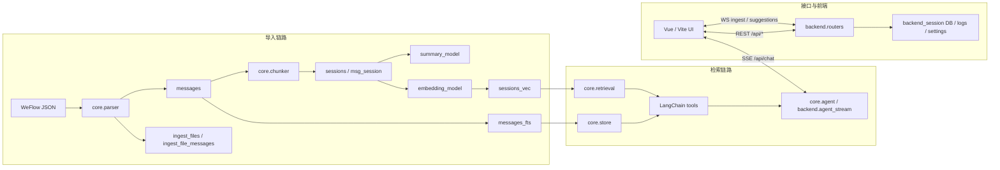

# 微信聊天记录检索 Agent 技术文档

更新时间：2026-06-22

本文档面向开发、维护和二次扩展。它描述当前代码的真实运行方式：本地 SQLite 数据模型、WeFlow JSON 导入、全文和向量检索、LangChain Agent、FastAPI 后端、Vue 前端、运行时配置、日志与隐私边界。接口级字段细节见 [`backend/API_DOCS.md`](../backend/API_DOCS.md)。

## 1. 系统目标与边界

项目目标是把 WeFlow 导出的微信聊天 JSON 转成本地可检索知识库，并通过自然语言查询、上下文追溯、时间浏览和统计接口回答问题。

核心能力：

- 解析 WeFlow JSON，保留文本、引用、链接、转账、位置、小程序、文件名、通话记录、名片、表情说明，以及 JSON 已包含的图片 OCR、语音转写和视频说明。
- 跳过没有可读文本的纯图片、视频、语音和无语义占位符，避免把原始媒体 payload 当聊天正文。
- 将消息、文件来源映射、会话分块、摘要和向量索引写入本地 SQLite。
- 使用 FTS5 trigram 支持中文全文检索，短词回退到 `LIKE`。
- 在配置 embedding 后使用 `sqlite-vec` 做会话块向量检索，并与 FTS 通过 RRF 融合。
- 通过 LangChain tools 让 Agent 调用关键词检索、语义检索、上下文追溯、时间浏览和统计工具。
- FastAPI 提供 REST、SSE 和 WebSocket 接口，Vue/Vite 前端提供聊天、设置、导入、健康、日志和统计面板。

明确边界：

- 本项目是本地工具，不包含用户认证、多租户隔离或公网安全网关。若部署到局域网或公网，需要自行加反向代理、鉴权和传输层安全。
- 本项目不会自动对原始媒体做 OCR/ASR，只读取 JSON 里已经存在的可读字段。
- `local/`、`runtime/`、`.env` 默认不提交到 Git，但 `runtime/backend_settings.json` 可能包含设置页保存的 API Key 运行时覆盖值。不要把 `runtime/` 或本地数据库外发。
- 日志和错误响应会做脱敏，但脱敏不是加密。密钥仍应优先放在本机 `.env` 或可信环境变量中。

## 2. 总体架构


```mermaid
flowchart LR
    subgraph "导入链路"
        A["WeFlow JSON"] --> B["core.parser"]
        B --> C["messages"]
        C --> D["messages_fts"]
        C --> E["core.chunker"]
        E --> F["sessions / msg_session"]
        F --> G["summary_model"]
        F --> H["embedding_model"]
        H --> I["sessions_vec"]
        B --> J["ingest_files / ingest_file_messages"]
    end

    subgraph "检索链路"
        D --> K["core.store"]
        I --> L["core.retrieval"]
        K --> M["LangChain tools"]
        L --> M
        M --> N["core.agent / backend.agent_stream"]
    end

    subgraph "接口与前端"
        O["Vue / Vite UI"] <-->|"SSE /api/chat"| N
        O <-->|"REST /api/*"| P["backend.routers"]
        O <-->|"WS ingest / suggestions"| P
        P --> Q["backend_session DB / logs / settings"]
    end
```

关键数据文件：

| 路径 | 用途 |
| --- | --- |
| `runtime/chat.db` | 聊天消息、FTS、会话分块和向量索引，受 `CHAT_DB` 控制 |
| `runtime/backend_chat.db` | Web 对话会话、消息和 reasoning 内容，受 `BACKEND_CHAT_DB` 控制 |
| `runtime/backend_settings.json` | 设置页保存的运行时覆盖值，受 `BACKEND_SETTINGS_FILE` 控制 |
| `runtime/backend.log.jsonl` | 后端 JSONL 诊断日志，受 `BACKEND_LOG_FILE` 控制 |
| `local/` | WeFlow JSON 和上传文件，接口只暴露相对 `file_id`，不返回服务器绝对路径 |

## 3. 目录与模块职责

```text
wechat_agent/
  backend/
    main.py             # FastAPI app、CORS、健康诊断、生命周期
    agent_stream.py     # SSE 版 Agent 循环、thinking/text/tool 事件、停止标记
    session_store.py    # Web 对话会话 SQLite
    schemas.py          # Pydantic 请求/响应模型
    errors.py           # 结构化错误响应和异常处理
    logging_utils.py    # JSONL 日志、轮转、近期日志读取
    redaction.py        # 后端兼容导出，复用 core.redaction
    routers/
      chat.py           # /api/chat、会话列表、消息、重命名、删除、停止生成
      ingest.py         # 上传、文件列表、导入任务、任务 WebSocket、删除源 JSON
      settings.py       # 运行时设置、模型列表、重置设置
      stats.py          # 概览、会话统计、发送人统计
      suggestions.py    # HTTP/WS 输入建议
      logs.py           # 近期日志查询
      params.py         # 查询参数容错解析
  core/
    agent.py            # 同步 Agent、工具策略、历史裁剪、问候兜底
    tools.py            # LangChain tools 和参数约束
    retrieval.py        # FTS 与向量会话块召回融合
    store.py            # 主 SQLite schema、检索、统计、索引维护
    parser.py           # WeFlow JSON 兼容解析和稳定 message_id scope
    chunker.py          # 按时间、长度和条数切分会话块
    ingest.py           # CLI 导入、自愈、摘要和 embedding 流水线
    llm.py              # OpenAI 兼容 chat/summary/embedding 客户端与重试
    redaction.py        # 共享脱敏规则
    scripts/
      check.py          # 配置连通性检查
      smoke.py          # 基于已有数据库的检索冒烟验证
  frontend/
    src/api/api.js      # REST/SSE/WS 封装、超时和错误归一化
    src/router.js       # `/` 聊天页、`/settings` 设置页
    src/views/          # 页面级视图
    src/components/     # 聊天、导入、健康、日志、统计、设置等面板
  docs/
    TECHNICAL.md
    CHANGELOG.md
  local/                # 本地原始数据，Git 忽略
  runtime/              # 本地数据库、日志、运行时设置，Git 忽略
  start_all.bat         # Windows 一键创建依赖并启动前后端
```

## 4. 运行环境与启动

后端依赖 Python 3.10+、SQLite FTS5、`sqlite-vec`、FastAPI、LangChain 和 OpenAI 兼容 SDK。前端依赖 Node.js、Vue 3、Vite、Tailwind、marked 和 DOMPurify。

常规开发启动：

```bash
python -m venv .venv
.venv\Scripts\activate
pip install -r requirements.txt
copy .env.example .env

python -m core.scripts.check
python -m uvicorn backend.main:app --reload

cd frontend
npm install
npm run dev
```

Windows 可使用：

```bat
start_all.bat
```

`start_all.bat` 会创建 `.env`、`.venv`，安装缺失依赖，然后分别启动 `http://localhost:8000` 后端和 `http://localhost:5173` 前端。Vite 端口被占用时会切换到 5174 等端口；后端默认允许本机 `5173-5180` 和 `3000`。

## 5. 配置与覆盖规则

配置来源按用途分三类：

| 来源 | 读取方 | 说明 |
| --- | --- | --- |
| `.env` / 进程环境变量 | 后端和 CLI | `load_dotenv()` 在核心模块和后端启动时加载，适合放密钥、数据库路径、模型端点 |
| `runtime/backend_settings.json` | `backend.routers.settings` | 设置页保存的运行时覆盖值，重启后会重新加载；重置设置会删除该文件 |
| `frontend/.env` 中的 `VITE_API_BASE` | Vite 构建/开发服务 | 控制前端连接的后端地址，留空字符串表示同源 `/api` |

### 5.1 模型与密钥

对话模型是 Agent 必需项：

| 变量 | 默认值 | 说明 |
| --- | --- | --- |
| `CHAT_BASE_URL` | 无 | OpenAI 兼容聊天接口，例如 `https://api.example.com/v1` |
| `CHAT_API_KEY` | 无 | 聊天 API Key |
| `CHAT_MODEL` | 无 | Agent 使用的聊天模型 |
| `CHAT_TIMEOUT` | `300` | 对话和摘要请求超时秒数 |
| `REQUEST_FAILURE_RETRIES` | `3` | 对话、摘要和 Embedding 远程 API 请求失败时共用的后端包装层重试次数 |
| `REQUEST_FAILURE_RETRY_INTERVAL` | `5` | 请求失败重试基础等待秒数；默认节奏为 `5, 5, 5, 10, 10, 10...` |
| `CHAT_REASONING_EFFORT` | 空 | 可选，`low` / `medium` / `high`，传给支持该参数的模型 |

摘要模型是可选项。未配置 `SUMMARY_MODEL` 时，导入仍可完成消息、FTS 和分块，但跳过摘要：

| 变量 | 默认值 | 说明 |
| --- | --- | --- |
| `SUMMARY_MODEL` | 无 | 摘要模型名 |
| `SUMMARY_BASE_URL` | 继承 `CHAT_BASE_URL` | 摘要专用 Base URL |
| `SUMMARY_API_KEY` | 继承 `CHAT_API_KEY` | 摘要专用 API Key |
| `SUMMARY_REASONING_EFFORT` | 继承 `CHAT_REASONING_EFFORT` | 摘要 reasoning effort |

Embedding 是可选项。未配置时，`semantic_search` 会退化为 FTS 会话块检索：

| 变量 | 默认值 | 说明 |
| --- | --- | --- |
| `EMBED_BASE_URL` | 无 | OpenAI 兼容 embedding 接口 |
| `EMBED_API_KEY` | 无 | Embedding API Key |
| `EMBED_MODEL` | 无 | Embedding 模型 |
| `EMBED_DIM` | `1024` | 初始向量表维度，导入时可按实际返回自动重建 |
| `EMBED_TIMEOUT` | `90` | 单次 embedding 请求超时秒数 |

旧版环境变量 `CHAT_MAX_RETRIES`、`EMBED_MAX_RETRIES` 和 `*_LOCAL_RETRIES` 仍会被兼容读取；如果未配置 `REQUEST_FAILURE_RETRIES`，后端会取旧字段中的较大值作为统一的请求失败重试次数。旧版 `*_RETRY_SLEEP` 也会作为 `REQUEST_FAILURE_RETRY_INTERVAL` 的兼容来源。SDK 内部重试会关闭，统一由后端包装层控制等待间隔。

`example.com`、`sk-...`、`your-*`、`changeme` 等模板占位值会被视为未配置，避免误连模板地址。

设置页可以修改部分模型运行参数。密钥输入后不会在 API 响应中返回，但若保存为运行时覆盖，它会写入 `BACKEND_SETTINGS_FILE` 指向的本地 JSON 文件。该文件位于 `runtime/` 时默认不会提交，但本地明文仍然存在。

### 5.2 导入与索引

| 变量 | 默认值 | 说明 |
| --- | --- | --- |
| `SUMMARY_WORKERS` | `2` | 摘要并发线程数 |
| `SUMMARY_BATCH_SIZE` | `4` | 每次摘要请求包含的会话块数量 |
| `SUMMARY_MAX_CHARS` | `3000` | 摘要单块输入最大字符数 |
| `SUMMARY_FALLBACK_CHARS` | `1200` | 422/BadRequest 后短文本重试字符数，`0` 表示禁用 |
| `EMBED_WORKERS` | `4` | Embedding 批次并发数 |
| `EMBED_BATCH_SIZE` | `32` | 每个 embedding 请求的会话块数量 |
| `PROGRESS_EVERY` | `50` | CLI 每处理多少块输出进度 |
| `PROGRESS_INTERVAL` | `15` | 无批次完成时的进度提示间隔秒数 |
| `INGEST_KEEP_GOING` | `false` | 摘要或 embedding 批次失败后是否继续 |
| `INGEST_MAX_UPLOAD_MB` | `512` | Web 上传 JSON 大小上限 |
| `INGEST_MAX_TASKS` | `100` | 后端内存中保留的导入任务数量 |
| `INGEST_MAX_TASK_LOG_LINES` | `5000` | 单任务内存日志保留行数 |
| `INGEST_MAX_TASK_LOG_LINE_CHARS` | `4000` | 单行任务日志最大字符数 |

CLI 参数会覆盖环境变量，例如 `--summary-workers`、`--embed-batch-size`、`--keep-going`、`--stop-on-error`。

### 5.3 后端、前端与日志

| 变量 | 默认值 | 说明 |
| --- | --- | --- |
| `CHAT_DB` | `runtime/chat.db` | 主聊天数据库路径，支持普通文件和 `file:` SQLite URI |
| `BACKEND_CHAT_DB` | `runtime/backend_chat.db` | Web 对话会话数据库路径 |
| `BACKEND_SETTINGS_FILE` | `runtime/backend_settings.json` | 设置页持久化文件 |
| `BACKEND_LOG_FILE` | `runtime/backend.log.jsonl` | 后端 JSONL 日志 |
| `BACKEND_LOG_MAX_MB` | `10` | 日志超过该大小后轮转为 `.1` |
| `HOST` | `0.0.0.0` | 直接运行 `backend.main` 时监听地址 |
| `PORT` | `8000` | 直接运行 `backend.main` 时监听端口 |
| `CORS_ORIGINS` | 空 | 额外允许来源，逗号分隔；本机 Vite 常用端口已默认允许 |
| `VITE_API_BASE` | 当前页面同主机 `:8000` | 前端 API 基址；设为空值时使用同源 `/api` |

## 6. SQLite 数据模型

### 6.1 主聊天库 `CHAT_DB`

`core.store.db()` 会开启 WAL、`busy_timeout=30000`、`synchronous=NORMAL` 和较大的 cache。普通路径会自动创建父目录，`file:` 开头时按 SQLite URI 打开。

| 表 | 作用 |
| --- | --- |
| `messages` | 单条聊天消息，字段包括 `id`、`sender`、`is_self`、`timestamp`、`content`、`msg_type`、`thread`、`reply_to`、`seq` |
| `messages_fts` | FTS5 external-content 表，`tokenize='trigram'`，以 `messages.rowid` 为内容行 |
| `sessions` | 会话块，字段包括时间范围、参与者 JSON、消息 ID JSON、完整块文本、可选摘要和 `text_hash` |
| `msg_session` | 消息 ID 到会话块 ID 的映射 |
| `ingest_files` | 文件大小、mtime、解析统计、`parser_version` 和更新时间 |
| `ingest_file_messages` | 源 JSON 路径到真实入库消息 ID 的来源映射 |
| `sessions_vec` | `sqlite-vec` 虚拟表，`session_id` 与 `FLOAT[N]` embedding 一对一 |

重要索引包括 `timestamp`、`sender`、`thread + seq`、`thread + timestamp`、`reply_to + thread`、`sender + timestamp`、`is_self + timestamp` 以及会话块时间和线程索引。

`text_hash` 用于避免内容未变的会话块重复摘要和重复 embedding。若 embedding 模型返回维度与现有 `sessions_vec` 不一致，导入流程会重建向量表。

### 6.2 Web 会话库 `BACKEND_CHAT_DB`

| 表 | 作用 |
| --- | --- |
| `backend_chat_sessions` | Web 聊天会话标题、状态、错误、创建和更新时间 |
| `backend_chat_messages` | 用户和助手消息、可选 `reasoning_content`、创建时间 |

后端启动时会把上次异常中断留下的 `running` / `aborting` 会话重置为 `idle`，并写入中断说明。

## 7. WeFlow 解析与消息身份

`core.parser.PARSER_VERSION` 当前为 `12`。解析版本写入 `ingest_files.parser_version`，解析规则升级后，即使 JSON 文件大小和 mtime 不变，也会显示为需要重新导入。

解析器兼容：

- 顶层消息列表：`messages`、`messageList`、`message_list`、`msgList`、`msg_list`、`chatRecords`、`chat_records`、`records`。
- 类型字段：`type`、`msgType`、`messageType`、`typeName`、`msgTypeName` 等，以及微信常见数字码，例如 `1` 文本、`3` 图片、`34` 语音、`43` 视频、`47` 表情、`49` 链接、`10000` 系统消息。
- 时间字段：`createTime`、`timestamp`、`createdAt`、`formattedTime`、`msgCreateTime`、`sentAt`、`time`，支持秒、毫秒、微秒 Unix 时间戳和 ISO 字符串。
- 正文字段：`content`、`text`、`message`、`body`、`msgContent`、`plainText`、`messageText`。
- 媒体可读字段：`ocrText`、`captionText`、`transcription`、`voiceText`、`videoText`、`mediaText` 等。
- 引用字段：顶层 `quotedContent/quotedSender` 和嵌套 `quote/refer/reply/reference`。
- 发送人字段：优先显示名和备注，再退回昵称、用户名或 wxid，避免群聊消息错误归到群名。

消息 ID 使用文件作用域前缀，避免多个 JSON 中的相同平台 ID 互相覆盖。上传文件会写 sidecar 元数据，记录稳定聊天 scope，优先使用 WeFlow 会话稳定 ID，缺失时退回会话显示名。同一聊天重复上传、改名上传或追加导出时，会按稳定 scope 合并到同一逻辑会话。

旧库兼容逻辑会在重新导入时尽量把早期裸 ID、basename scoped ID、随机上传 UUID scoped ID 升级为当前 scoped ID，并修复 `reply_to` 指向同文件作用域下的真实消息。

## 8. 导入与索引流水线

CLI 入口：

```bash
python -m core.ingest local/data
python -m core.ingest local/data --force-import
python -m core.ingest local/data --force-rebuild
python -m core.ingest local/data --skip-import --force-fts
python -m core.ingest local/data --skip-import --force-chunks
python -m core.ingest local/data --skip-import --force-summary
python -m core.ingest local/data --skip-import --force-embeddings
```

导入步骤：

1. 收集目标路径下的 `.json` 文件，按路径稳定排序。目标可以是多个文件或目录。
2. 检查 `ingest_files`。普通增量模式会跳过大小、mtime 和解析版本都未变化的文件。
3. 解析 WeFlow JSON，生成 `NormMessage`，执行 upsert。新增和更新都会被统计。
4. 记录 `ingest_file_messages` 来源映射，只记录当前数据库中真实存在的消息 ID。
5. 修复缺失 `seq`，同步或重建 FTS。若已有消息内容被修正，FTS 会全量刷新以清理旧 token。
6. 按线程重建或复用会话块。分块规则主要基于时间间隔、块长度和消息条数。
7. 按需生成摘要。摘要批处理并发执行，长输入遇到 422/BadRequest 可用 fallback 字符数重试。
8. 按需生成 embedding。摘要新生成时，相应块的向量会连带重建，因为 embedding 输入包含摘要前缀。

导入模式语义：

| 模式 | CLI/API 表达 | 语义 |
| --- | --- | --- |
| 增量 | 默认 / `incremental` | 只解析变化或解析版本过期的 JSON，并自动补齐缺失索引 |
| 全流程 | `--force-import` / `full` | 强制重新解析目标 JSON，必要时补齐后续阶段 |
| 强制重建 | `--force-rebuild` / `rebuild` | 强制重新解析，并重建目标范围 FTS、分块、摘要和向量 |
| 仅 FTS | `--skip-import --force-fts` / `fts` | 只基于已有数据库刷新目标 JSON 关联消息 FTS |
| 仅分块 | `--skip-import --force-chunks` / `chunks` | 只基于已有数据库重建目标范围会话块 |
| 仅摘要 | `--skip-import --force-summary` / `summary` | 只重新生成目标范围已有会话块摘要 |
| 仅向量 | `--skip-import --force-embeddings` / `embeddings` 或 `vector` | 只重建目标范围已有会话块向量 |

单项构建必须能定位到已入库消息或会话块。未导入、来源映射缺失、空目录或没有会话块的目标会被拒绝，避免误把 0 条修复当成功。

普通增量、全流程和强制重建包含自愈逻辑：发现缺 FTS、缺 `seq`、缺摘要或缺向量时会自动补齐。显式单项构建只执行用户选择的阶段，不会暗中调用摘要或 embedding。

## 9. Web 导入任务

`backend.routers.ingest` 提供上传、文件列表、启动任务、任务状态、取消任务和 WebSocket 进度。

上传流程：

- `POST /api/ingest/upload` 接收单个 multipart JSON。
- 后端先写临时文件，校验 JSON 和 WeFlow 结构，计算稳定 scope，写 `.meta` sidecar，再替换为最终 `.json`。
- 空文件、损坏 JSON、非 WeFlow 结构和超大文件会返回错误，不保留半成功文件。

任务流程：

- `POST /api/ingest/start` 同一时间只允许一个导入任务运行。
- 后端创建任务记录后启动子进程执行 `python -m core.ingest`。
- 子进程环境中设置 `INGEST_PROGRESS_JSON=true`，`core.ingest` 会输出以 `__INGEST_PROGRESS__ ` 开头的结构化进度事件。
- 结构化事件只更新内存任务状态，不进入用户可见日志；普通文本日志会保留尾部给前端查看。
- `WS /api/ws/ingest/{task_id}` 每秒左右推送 `status`、`progress`、`stage`、`message`、`eta`、`log_tail`。
- 后端关闭时会请求取消运行中任务，避免重启后继续显示运行中。

任务列表只保存在当前后端进程内，重启会清空历史任务列表。已入库数据和文件导入记录不依赖任务列表。

## 10. 检索与 Agent

### 10.1 工具

当前 LangChain tools：

| 工具 | 主要用途 | 限制 |
| --- | --- | --- |
| `search_messages` | 精确关键词、原话、人名、店名、专有名词 | `query <= 500`，`limit <= 100` |
| `semantic_search` | 模糊主题、自然语言描述、关键词无结果后的补充 | `query <= 2000`，`limit <= 20` |
| `get_context` | 获取某条消息前后上下文和引用消息 | `before/after <= 50` |
| `browse_by_time` | 按时间顺序浏览某段聊天 | `limit <= 200` |
| `get_stats` | 数据规模、会话、发送人、时间跨度 | 无参数 |

工具参数先经过 Pydantic 校验，再进入 `core.store`。直接调用存储层时也会做二次容错，包括裁剪 limit、规范时间、过滤空白查询和转义 FTS/LIKE 特殊字符。

### 10.2 检索策略

`search_messages` 在所有词长度大于等于 3 时使用 FTS5 trigram，否则使用 `LIKE`。多个关键词是 AND 语义（须同一条消息内全部出现）；AND 零命中且有多个关键词时自动放宽为 OR 重查，`note` 会说明放宽行为，LIKE 路径按命中关键词数排序。返回消息预览会围绕第一个命中词截取，避免命中词被截掉。

`semantic_search` 同时运行：

- `fts_search_sessions()`：先用消息 FTS 找到相关消息，再映射到会话块。查询会先经 `_semantic_fts_terms()` 拆词：按标点/非文字符号分段，超过 4 字的中文段拆成滑动 trigram（步长 2、末尾补齐），避免整句短语匹配零召回。
- `vector_search_sessions()`：使用 embedding 查询 `sessions_vec`。

两个结果用 Reciprocal Rank Fusion 合并。若指定 `thread`、`after`、`before`，过滤条件会尽量下推到 FTS 和向量候选召回阶段。过滤范围内无命中时，才返回该范围最近会话块作为明确标注的兜底；无过滤时不会返回最近会话，避免误把无关聊天当证据。

### 10.3 Agent 循环与 SSE

同步 CLI 使用 `core.agent.run_agent()`；Web 使用 `backend.agent_stream.stream_agent()`。两者共用工具执行层与提示词构造。

流程：

1. 规范化问题并裁剪历史，只保留 user/assistant 消息。
2. 简单问候直接本地回答，不初始化模型。
3. 构造系统提示词：用户可编辑的基础提示词 + 当前启用/停用工具策略 + 检索努力档位纪律 + 动态数据概况（当前时间、记录跨度、Top 会话/发送人；空库时引导先导入）。工具策略优先于用户自定义提示词。
4. 调用聊天模型。若返回 tool calls，逐个执行工具并把结果送回模型；同一提问内完全相同的 (工具, 参数) 重复调用会被拦截并返回换策略提示（失败的调用允许原样重试）。
5. 达到轮数上限后，若已有工具结果则基于全部检索成果强制综合作答，综合失败才回退固定文案。
6. 若模型在工具后返回空文本，会用工具结果再请求一次综合回答。

检索努力档位 `SEARCH_EFFORT`（默认 `medium`）：

| 档位 | 轮数上限 | 引导次数 | 定位 |
| --- | --- | --- | --- |
| `low` | 6 | 1 | 快速模式，1~3 次调用内作答 |
| `medium` | 12 | 2 | 均衡模式（默认） |
| `high` | 20 | 3 | 深挖模式，交叉印证 |
| `max` | 32 | 4 | 穷尽模式，多策略排查后才允许说找不到 |

档位可通过环境变量 `SEARCH_EFFORT` 初始化，`core.agent.set_search_effort()` 运行时切换（同步更新 `MAX_ROUNDS`/`MAX_NUDGES`），`run_agent(..., effort=...)` / `stream_agent(..., effort=...)` 单次调用覆盖，CLI 中用 `/effort <档位>` 切换，Web 端通过 `POST /api/chat` 请求体的可选 `effort` 字段按次指定（前端输入区提供"检索强度"选择器）。设置页单独修改过 `max_rounds` 时，同档位调用继续尊重该值。

性能说明：系统提示词中的"数据概况"聚合有 10 秒 TTL 缓存（按 `CHAT_DB` 路径隔离）；`/api/ws/suggestions` 的建议查询在线程池中执行，不会阻塞事件循环。

SSE 事件：

| 事件 | 数据 | 说明 |
| --- | --- | --- |
| `session` | `{"session_id","status"}` | `/api/chat` 包装层首先返回，用于前端立即获得会话 ID |
| `thinking` | `{"chunk"}` | 模型返回的 reasoning/thinking 片段，若模型不提供则没有该事件 |
| `tool_call` | `{"name","args"}` | 工具调用前的脱敏参数预览 |
| `tool_result` | `{"name","summary"}` | 工具结果轻量摘要，错误会以错误摘要展示 |
| `text` | `{"chunk"}` | 助手回答片段 |
| `done` | `{"answer","thinking","session_id"}` | 完整答案、完整 thinking 和会话 ID |
| `error` | `{"detail"}` | 初始化或执行失败 |

停止生成通过 `POST /api/chat/{session_id}/abort` 设置中止标记。远程模型请求不能瞬时杀掉，但后端会在模型返回、工具调用前后和流式片段之间尽快停止，并可保存前端提交的部分回答。

## 11. 后端 API 层

后端入口 `backend.main`：

- 初始化主库和 Web 会话库。
- 注册 CORS、结构化错误处理和所有路由。
- 提供 `/api/health` 与 `/api/health/diagnostics`。
- 生命周期结束时关闭数据库连接并停止导入任务。

主要路由：

| 路由 | 模块 | 说明 |
| --- | --- | --- |
| `/api/chat` | `routers.chat` | SSE 对话、会话持久化、停止生成 |
| `/api/chat/sessions` | `routers.chat` | 会话分页、批量删除 |
| `/api/settings` | `routers.settings` | 设置读取、保存、重置 |
| `/api/settings/models` | `routers.settings` | 调用 OpenAI 兼容 `/models` 列出 chat 或 summary 模型 |
| `/api/ingest/*` | `routers.ingest` | 文件列表、上传、删除、启动任务、状态、取消 |
| `/api/ws/ingest/{task_id}` | `routers.ingest` | 导入进度 WebSocket |
| `/api/stats*` | `routers.stats` | 统计概览和分页详情 |
| `/api/suggestions` | `routers.suggestions` | HTTP 输入建议 |
| `/api/ws/suggestions` | `routers.suggestions` | WebSocket 输入建议 |
| `/api/logs` | `routers.logs` | 近期日志 |

所有 HTTP 异常尽量返回统一结构：

```json
{
  "error": {
    "code": "HTTP_400",
    "type": "http_error",
    "message": "可读错误",
    "recoverable": true,
    "action": "建议操作",
    "path": "/api/..."
  }
}
```

验证错误会隐藏原始输入；未处理异常只返回通用 500，同时详细 traceback 写入本地 JSONL 日志。

## 12. 前端架构

前端是 Vue 3 + Vite 单页应用：

- `/`：聊天页，包含会话侧栏、消息流、输入框、建议、停止生成。
- `/settings`：设置页，包含对话设置、数据导入、健康诊断、运行日志和统计面板。
- 其他路由重定向到 `/`。

`frontend/src/api/api.js` 统一封装：

- REST 请求默认 60 秒超时，上传默认 10 分钟超时。
- `chatSSE()` 手动解析 SSE 事件，支持 `thinking`、工具事件和终态检测。
- WebSocket 地址从 API 基址自动转换 `http -> ws`、`https -> wss`。
- 错误对象会从 FastAPI `detail`、统一 `error` 结构和 Pydantic 字段路径中提取可读文案。
- `VITE_API_BASE` 未设置时，默认连接当前页面同主机名的 `:8000`；设为空字符串时连接同源 `/api`。

前端会对 Markdown 回答做 DOMPurify 清洗，并限制危险标签和协议，避免聊天回答自动加载外部资源或注入脚本。

## 13. 日志、脱敏与诊断

`core.redaction` 统一处理面向用户和日志的敏感信息脱敏，覆盖：

- URL 中的用户信息。
- `sk-*` 风格密钥。
- `Authorization`、`Bearer`、`api_key`、`token`、`secret`、`password`、`passwd` 等键值。
- JSON、URL query 和带引号字段中的敏感值。

`backend.logging_utils` 写入 JSONL 日志：

- 每行包含 `timestamp`、`level`、`logger`、`message`、源码模块/函数/行号、可选 `details` 和 `traceback`。
- 日志超过 `BACKEND_LOG_MAX_MB` 后轮转为 `.1`。
- `/api/logs` 从当前日志尾部倒序读取，不足时再读 `.1`，并再次脱敏。
- 部分内部英文消息会映射为中文展示文案。

健康诊断会检查：

- 主聊天数据库是否可读、是否已有消息。
- Web 会话库是否可用。
- 聊天模型、摘要模型、embedding 配置是否完整。
- `sqlite-vec` 是否可用，已有会话块中多少有向量。
- 是否存在可由前端处理的跳转建议，例如 `settings`、`ingest`、`logs`。

## 14. 开发验证

常规验证命令：

```bash
python -m unittest discover -s tests
python -m ruff check core backend tests
python -m compileall -q core backend tests
cd frontend
npm run build
```

已有本地数据库时可运行：

```bash
python -m core.scripts.smoke
```

`smoke` 会抽样验证关键词检索、上下文追溯、时间浏览、统计和会话块检索。未导入数据或关键检索步骤失败时返回非零状态。

配置检查：

```bash
python -m core.scripts.check
```

该脚本用于确认聊天模型和 embedding 端点配置状态。`.env.example` 中的占位值会按未配置处理。

## 15. 运维注意事项

- 首次导入或解析器升级后，使用增量、全流程或强制重建，不要直接使用 `--skip-import` 单项模式。
- 若 JSON 已入库但摘要或向量失败，修复模型配置后直接重跑导入即可自愈。
- 若只想修复已有库中的向量，先确认文件列表能定位来源映射，再使用仅向量构建。
- 若健康诊断显示有消息但无会话块，先运行仅分块或完整导入，再考虑摘要和向量。
- 若更换 embedding 模型，注意维度可能变化，导入流程会重建 `sessions_vec`。
- 不要把 `local/`、`runtime/`、`.env`、数据库或日志文件提交或发给第三方。
- 长期运行时关注 `runtime/backend.log.jsonl` 大小和导入任务日志保留量。

## 16. 后续可改进方向

1. 增加鉴权和部署模板，让局域网或公网使用时有默认保护。
2. 将导入任务从进程内任务表迁移到持久任务队列，支持后端重启后恢复任务历史。
3. 为本地设置文件中的 API Key 增加可选加密或改为只允许 `.env` 持有密钥。
4. 增加外部 OCR/ASR 插件，把媒体识别结果以明确文本字段回填后再进入 FTS。
5. 增加可审计的脱敏导出流程，生成可共享的匿名 SQLite 副本。
